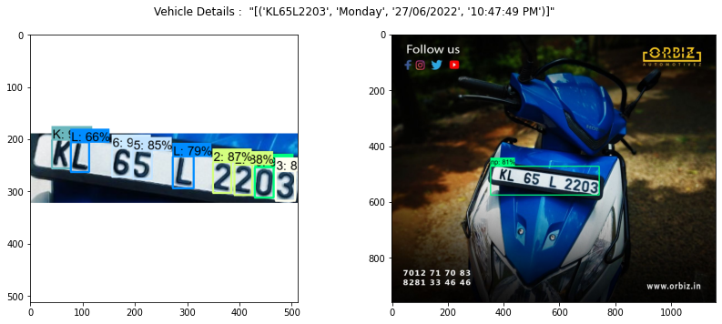
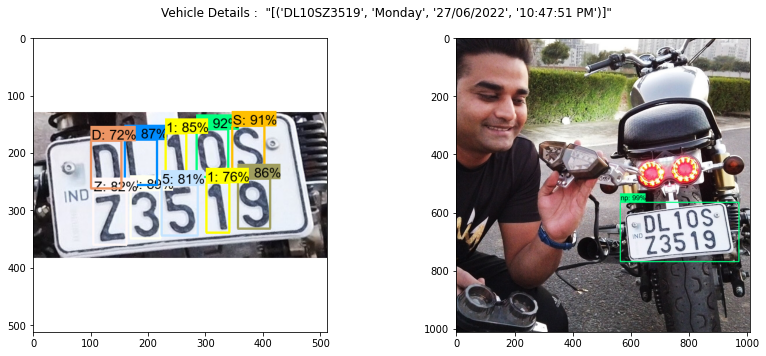
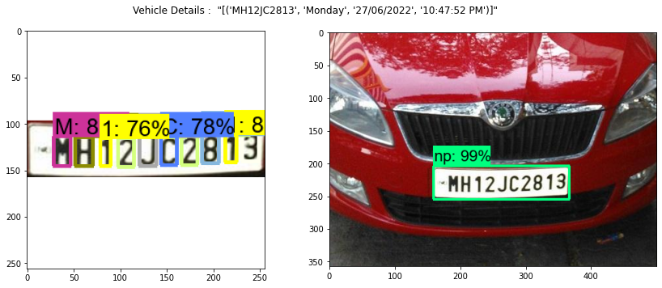
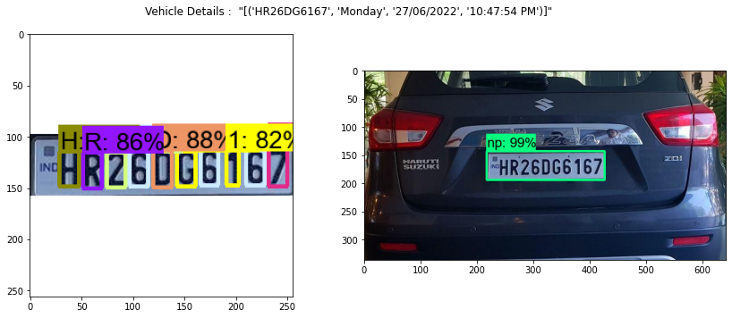
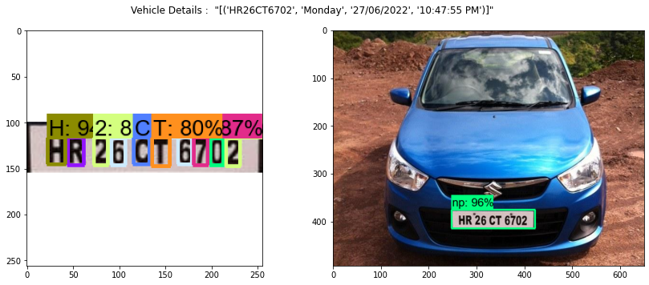
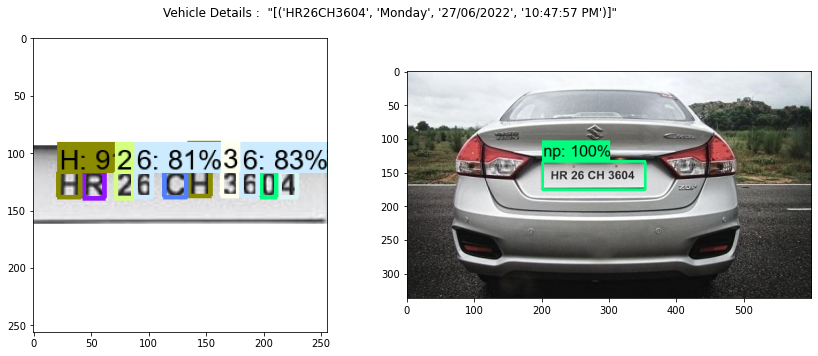
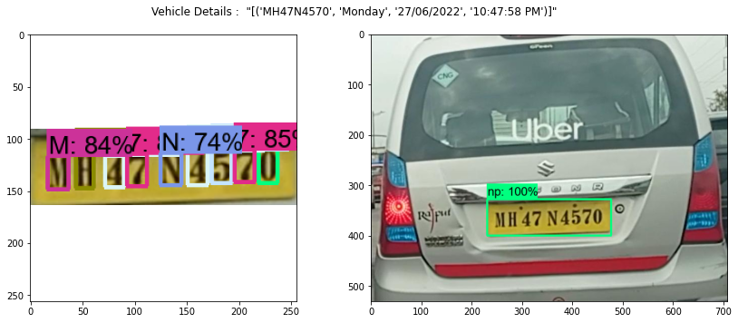
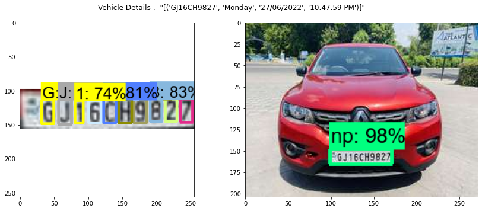
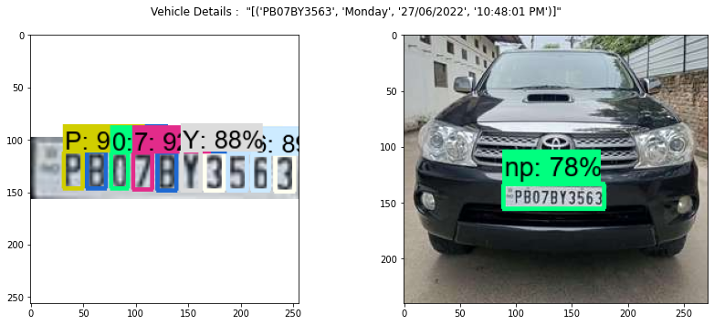
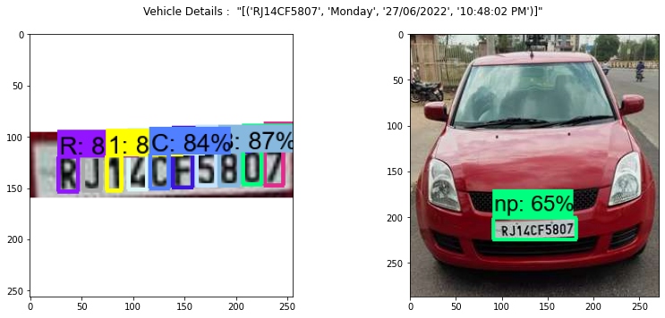

<font size=+3 color="#3D3D3D"><center><b>Automated Number Plate Recognition</b></center></font>


<center><em>Photo by 
Omnitec Group </em></center>


Automated recognizing of Vehicle number is an valuable solution and can be used for the following applications.
 - Law Enforcement , Verify vehicle license and registration. Provides an automatic alert when blacklisted vehicles pass by
 - Parking Guidance, Automatically recognize available parking spots and guides vehicles along the best route
 - Entrance & Exit Control, Raise barriers for authorized vehicles
 
Let's look at the Process flow diagram of ANPR 


#### Following are the output of Model2 and Model1 of ANPR alongwith vehicle details


```python
folder_path = 'test_images'
predict(folder_path,0.6)
```

    KL65L2203
    


    

    


    DL10SZ3519
    


    

    


    MH12JC2813
    


    

    


    HR26DG6167
    


    

    


    HR26CT6702
    


    

    


    HR26CH3604
    


    

    


    MH47N4570
    


    

    


    GJ16CH9827
    


    

    


    PB07BY3563
    


    

    


    RJ14CF5807
    


    

    


```python

```
